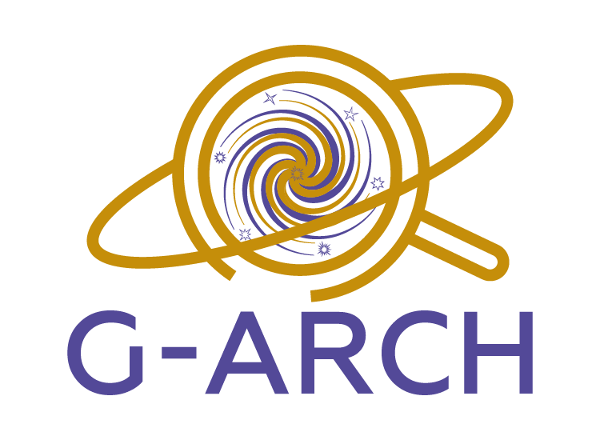

# G-Arch

## Local installation

G-Arch can be run locally at `http://0.0.0.0` (here a path_prefix is defined in the docker-compose.yml):

    git clone https://github.com/explore-platform/g-arch.git
    cd g-arch
    docker-compose up --build

Requires `docker`.

Install data files (see next section) in a local folder and update `docker-compose.yml` to point to this folder.

## Data

Input data files can be retrieved from Zenodo [ZenodoID](https://zenodo.org/).
For local deployment these can be added to '__APP_DATA/science/'.

## App structure

This project is composed of 3 components which are in a single docker container.

* visualiser (the frontend) - a react project built with vite
* api (backend api) - the api to interface with the science algorithm, in this cas the matissev4
* science (science algorithm) - The G-Arch main algorithm section

## How does it work

### API & Mv4
The API simply allows the app to launch the Mv4 algorithm by generating the properties file that will be used by the script, and then using the CLI to launch it with this properties file

### The UI

1. Allows the user to call the API with the required inputs and parameters
2. Allows the user to visualise said data via plots and tables

## Development roadmap

- [ ] adapt to new data, if required (e.g. Gaia DR4)
- [ ] UI improvements (user feedback)
- [ ] implement new version of Matisse code

## Acknowledgements

This project has received funding from the European Union’s Horizon 2020 research and innovation programme under grant agreement No 101004214. 

 
